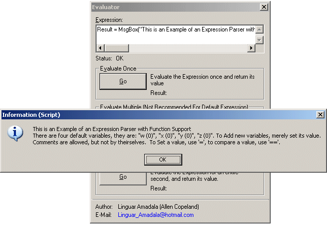



## Expression Evaluator \(with function support\)

### Description

Evaluates the input text and returns the result. Supports: multiple-argument functions, strings, octal, hexadecimal and decimal numbers, Recursion based method calls (as long as your stack holds out, it should be able to handle what you put into it)
 
### More Info
 
The Code to be interpreted

Uses Lexical Analysis to break up input into a stream of tokens that will be sent (during evaluation) to a semantic expression parser, which orders the expression in proper order of operations.. After both steps are done it's passed onto a third procedure, the interpreter during the evaluation process

The Semantic Expression Structure

If you press the "Go" button on the multiple evaluate section (middle of the three), and you don't change it from the default value of 1000 (in the text box shown) it will evaluate 1000 times before stopping.

The only drawback of this method is it is inevitably going to have speed difficulties with complex operations if needed thousands of times, due to recursion.

             |
---                |---
**Submitted On**   |2002-09-16 17:31:56
**By**             |[Linguar Amadala](https://github.com/Planet-Source-Code/PSCIndex/blob/master/ByAuthor/linguar-amadala.md)
**Level**          |Advanced
**User Rating**    |5.0 (15 globes from 3 users)
**Compatibility**  |VB 6\.0
**Category**       |[Miscellaneous](https://github.com/Planet-Source-Code/PSCIndex/blob/master/ByCategory/miscellaneous__1-1.md)
**World**          |[Visual Basic](https://github.com/Planet-Source-Code/PSCIndex/blob/master/ByWorld/visual-basic.md)
**Archive File**   |[Expression1417391072002\.zip](https://github.com/Planet-Source-Code/linguar-amadala-expression-evaluator-with-function-support__1-39605/archive/master.zip)

